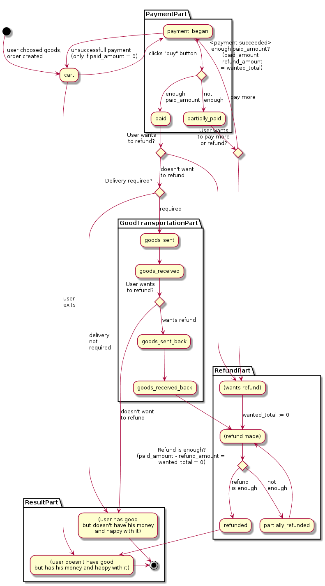

Замечания по реализации
=======================

SQL Alchemy/Alembic
-------------------

Были использованы ненативные Enum (`native_enum=False`) потому что PostrgreSQL хоть и умеет добавлять возможные значения в тип данных enum (`ALTER TYPE enum_type ADD VALUE 'new_value';`), ДО СИХ ПОР НЕ УМЕЕТ УДАЛЯТЬ ИЗ ENUM ЗНАЧЕНИЯ (FFFUUUUUU~), потому миграции на тип Enum не представляются возможными.

см. http://stackoverflow.com/questions/1771543/postgresql-updating-an-enum-type

TODO
====

TODO check this:

	pip freeze > requirements.txt

        //TODO: how to install ColanderAlchemy simplier?

//	pip install ColanderAlchemy
//	cd venv/lib/python3.4/site-packages
//	unzip ColanderAlchemy-0.3.3-py3.4.egg
//	rm -r EGG-INFO

DB
===

zdorovie-legkie.ru db

### user_

id, login, name, email, group_, email_check_code, email_checked, password_hash

### article

id, name, system_name, path, active_revision_id, active, is_template

### article_revision

id, article_id, parent_revision_id, code, author_id, created_at, author_id

### good

id, name, price, is_egood, file_path, active

### order

id, status, wanted_total, paid_amount, refund_amount, user_id

wanted_total - сумма желаемого у клиента товара: если paid_amount - refund_amount = wanted_total => заказ оплачен (paid) либо отменен полностью (refunded) если wanted_total = 0

status = `[cart, payment_began, paid, partially_paid, refunded, partially_refunded, goods_sent, goods_received, goods_sent_back, goods_received_back,]`

### order_good

id, order_id, good_id, price, wanted_count, wanted_total, refund_count, paid_amount, refund_amount, client_has_count

(order_id, good_id, price) - like pk, never change after creation

### order_good_status

id, previous_id, order_good_id, date_time, (succeed), is_last, status, count, shop_money_delta, money_transaction_id, money_transaction_status_id

status in `[wanted_alter, payment_began, payment_failed, paid, refund_began, refund_failed, refunded, good_sent, good_received, good_sent_back ]`

TODO иногда total -> sum переименовать

### refund

id, order_id, reason, datetime, status, total, refunded, userId, (datetime?)

status in `[created, canceled, refunded, timeout, error]`

### refund_order_good

id, refund_id, order_good_id, count, total, refund_amount, status, userId

### egood_download_link

id, (domain?), egood_id, download_code, for_user_id, datetime, expires, active, downloads_count

### money_transaction

id, order_id, type (buy/reject), shop_money_delta, status, payment_system

status in `[timeout, error, succeed]`

### money_transaction_status

id, money_transaction_id, provider, status, datetime, request_data, url, info_data, error, status, outcome, comment

type in `[payment, payment_refund]`

status in `[payment_initialisation, payment_form_sent, payment_notification_received, payment_notification_answered, refund_request_sent, refund_notification_received, refund_failed]`

Current db state:

Naming conventions
==================

Python
------

http://stackoverflow.com/a/160830/1760643

David Goodger (in "Code Like a Pythonista" here) describes the PEP 8 recommendations as follows:

    joined_lower for functions, methods, attributes, variables

    joined_lower or ALL_CAPS for constants

    StudlyCaps for classes (but joined_lowercase.py for modules)

    camelCase only to conform to pre-existing conventions

(end of citation)

http://www.alberton.info/dbms_identifiers_and_case_sensitivity.html

Database
--------

PostgreSql is NOT case-sensitive and quoted identifiers are pain so conventions for databases:

table names: `joined_lower`, singular (as in drupal)
fields: `joined_lower`, singular

If identifier already exists in database management system, use underscore at the end of identifier: `joined_lower_`. Why at the end? Because for autocompletion by first letter.
 
`datetime` considered as prohibited identifier (to
 not be confused with python's library `datetime` in code and mysql's `DATETIME` column type)

`group` may be confused with sql's `GROUP`.

`order` may be confused with sql's `ORDER BY`.
 
Бизнес-объекты
--------------

(deprecated, need review) существующий заказ: добавлять товары нельзя, убирать тоже, можно делать частичный или полный возврат, подтверждать доставку (для электронных товаров подтверждается при скачивании). админ может подтверждать оплату.

Order state graph:

One click buy sequence diagram:

Docstrings
----------

http://thomas-cokelaer.info/tutorials/sphinx/rest_syntax.html
различные виды: http://stackoverflow.com/a/24385103/1760643
документирование типов для PyCharm: https://www.jetbrains.com/help/pycharm/5.0/type-hinting-in-pycharm.html

about what?? - https://docs.python.org/devguide/documenting.html

working example:

	payment_client = payment_systems.get_payment_client_by_name(payment_system)
	""":type payment_client AbstractPaymentClient"""

Typing
------

https://docs.python.org/3/library/typing.html

TODO
----

datatables font size--
register user by buying (email password)
merge user accounts (different email)
errors system